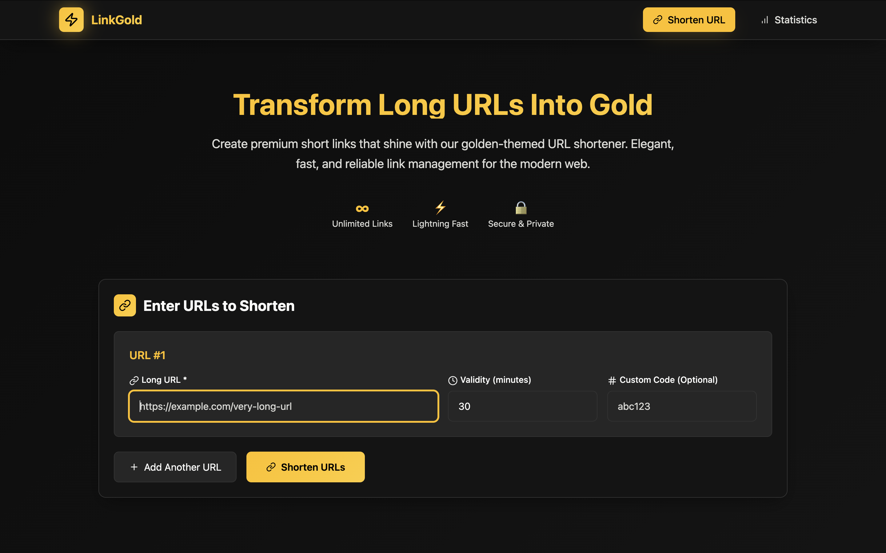
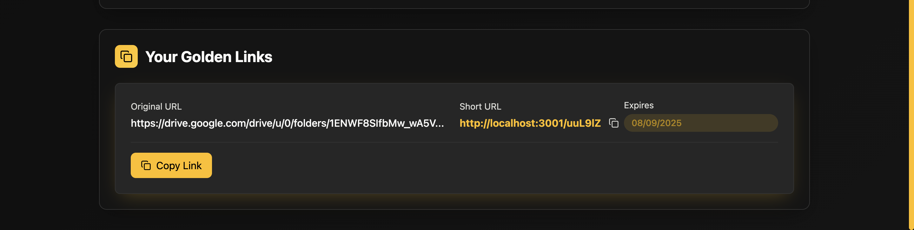
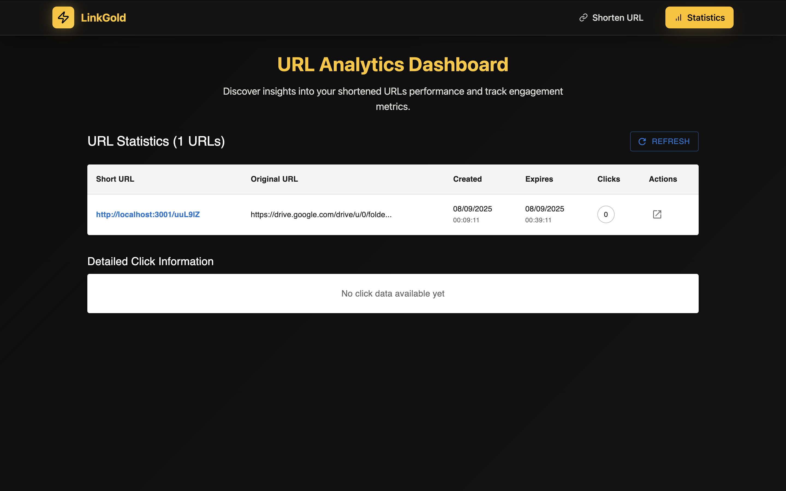

LinkGold (React + Vite + TypeScript)

A frontend-only URL shortener built with React, TypeScript, Vite, Tailwind CSS, and MUI. Create short links (optionally with custom codes), set expiry in minutes, copy/share the link, redirect via shortcode, and view local statistics — all persisted in the browser using localStorage.

## Features
- Create short URLs for any valid link
- Optional custom shortcode (alphanumeric, 4–10 characters) with collision checks
- Per-link expiry in minutes
- Copy-to-clipboard for generated short URLs
- Visit `/:shortcode` to auto-redirect to the original URL (if not expired)
- Statistics page shows:
  - All saved short URLs
  - Original URL, created/expiry times
  - Total clicks and per-click details (timestamp, source, location placeholder)
- Structured logging via an internal logging middleware
- No backend required (localStorage-based)

## Screenshots

- Home — Create short URLs



- Redirect and error states



- Statistics — Clicks and details



## Tech Stack
- React 18 + TypeScript
- Vite 5 (dev server on port 3000)
- Tailwind CSS 3
- Material UI (MUI)
- lucide-react icons
- React Router

## Getting Started

### Prerequisites
- Node.js 18+ and npm

### Install
```bash
npm install
```

### Run (development)
```bash
npm run dev
```
Open http://localhost:3000 in your browser.

### Build (production)
```bash
npm run build
```

### Preview production build
```bash
npm run preview
```

## Usage
1. On the home page, enter a valid long URL.
2. (Optional) Set validity in minutes. Default is 30.
3. (Optional) Provide a custom shortcode (alphanumeric, 4–10 characters). If taken, you’ll get an error.
4. Click “Shorten URLs”.
5. Copy the generated short URL and share it. Visiting it will redirect to the original URL until it expires.
6. Go to the “Stats” page to see saved URLs, clicks, and per-click details.

## Routes
- `/` — Home (URL creation UI)
- `/stats` — Local statistics page
- `/:shortcode` — Redirect page. Resolves the shortcode from localStorage, validates expiry, logs the click, and redirects.

## Data Model (localStorage)
All shortened URLs are stored under the `shortenedUrls` key as a map keyed by `shortcode`:
```json
{
  "Ab3xYz": {
    "longUrl": "https://example.com/some/long/path",
    "shortcode": "Ab3xYz",
    "createdAt": "2024-01-01T00:00:00.000Z",
    "expiresAt": "2024-01-01T00:30:00.000Z",
    "clicks": 3,
    "clickDetails": [
      { "timestamp": "2024-01-01T00:05:00.000Z", "source": "Direct", "location": "Unknown" }
    ]
  }
}
```

## Configuration Notes
- Dev server port is set in `vite.config.ts` → `server.port = 3000`.
- `src/utils/api.tsx` contains an auth token request for an evaluation service; URL shortening and stats themselves are simulated in the frontend via localStorage.

## Project Structure (high-level)
```
src/
  App.tsx                  # Routes and app shell
  components/
    UrlShortener.tsx       # Main URL creation UI
    RedirectPage.tsx       # Shortcode resolution + redirect
    Statistics.tsx         # Local stats table with details
    Navigation.tsx         # Top navigation
  pages/
    HomePage.tsx           # Hosts UrlShortener
    StatsPage.tsx          # Hosts Statistics
  contexts/
    AuthContext.tsx        # Simple auth token context
  utils/
    api.tsx                # Token fetch; localStorage-based shorten + stats
    loggingMiddleware.tsx  # Event logging helper
    validation.tsx         # URL and shortcode validation
```

## Validation Rules
- URL must be non-empty and valid.
- Custom shortcode (if provided): alphanumeric, 4–10 characters.
- Validity must be a positive number (minutes).

## Limitations
- No real backend storage or analytics — all data is in the user’s browser.
- "Location" in click details is a placeholder ("Unknown").
- Clearing site data or switching browsers/devices removes saved URLs.

## Scripts
- `npm run dev` — Start dev server (port 3000)
- `npm run build` — Production build
- `npm run preview` — Preview built assets
- `npm run lint` — Lint the project

